# This Dog Doesn't Exist 

 

 
  

    
    
    
    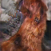
    
    
    
  

  

    
    
    
    
    
    
  
 
  

    
    
    
    
    
    
    
  

  

    
    
    
    
    
    
  

  

    
    
    
    
    
    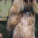
    
  

  

    
    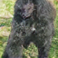
    
    
    
    
  

  

    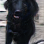
    
    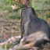
    
    
    
    
  

  

    
    
    
    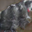
    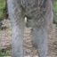
    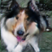
  
 
    

    
    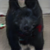
    
    
    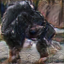
    
    
  

  

    
    
    
    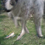
    
    
  

  

    
    
    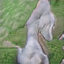
    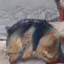
    
    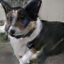
    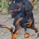
  

  

    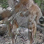
    
    
    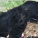
    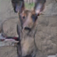
    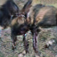
  
 
  

 
 
 

## Generative Dog Images Kaggle 2019

Use your training skills to create images, rather than identify them. You’ll be using **GANs**, which are at the creative frontier of machine learning. You might think of *GANs* as robot artists in a sense—able to create eerily lifelike images, and even digital worlds.

> You might not think that programmers are artists, but programming is an extremely creative profession. It’s logic-based creativity. - John Romero

A generative adversarial network (*GAN*) is a class of machine learning system invented by [Ian Goodfellow in 2014](https://arxiv.org/pdf/1406.2661.pdf). Two neural networks compete with each other in a game. Given a training set, this technique learns to generate new data with the same statistics as the training set.

In this competition, you’ll be training generative models to create images of dogs. Only this time… there’s no ground truth data for you to predict. Here, you’ll submit the images and be scored based on how well those images are classified as dogs from pre-trained neural networks. Take these images, for example. 

Can you tell which are real vs. generated?

*Trick question; they are all generated!*

 

## Contributors 

- [Tom](https://www.kaggle.com/tikutiku) winner of the competition!
- [Nanashi](https://www.kaggle.com/jesucristo) 12th place. creator & owner.

